# PopQuizzer

I created this multiple choice quiz with three levels of difficulty and nine categories for my second milestone project whilst studying with the Code Institute. The site features one page with subsuquent sections being added dynamically rather than loading new pages. The site uses API data from [Open Trivia](https://opentdb.com/) to generate the questions and answers so the user should not receive the same questions twice or more in quick succession.

The aim of the site is to provide the user with a fun, interactive quiz experience that they can tailor to their intersets and knowledge level.

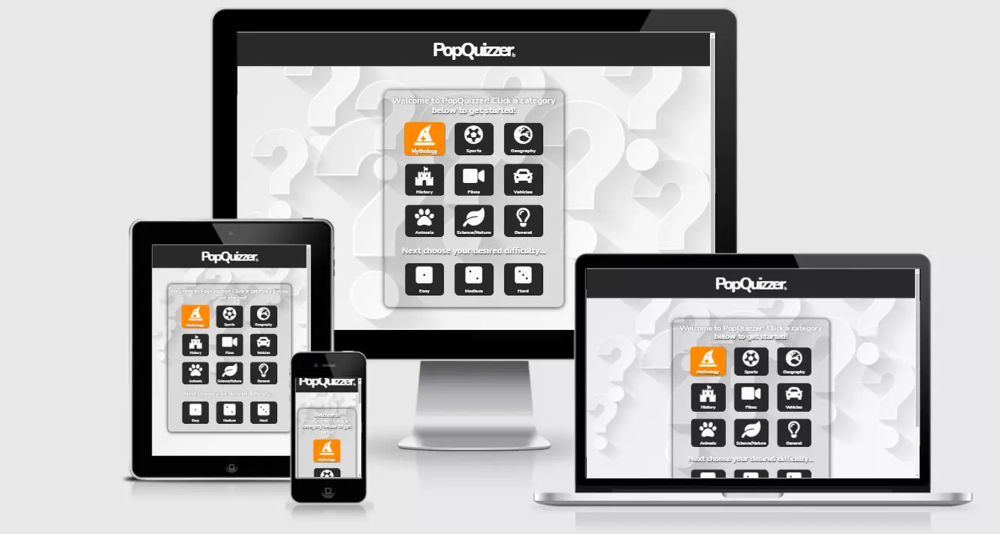

- [PopQuizzer](#popquizzer)
- [UX](#ux)
  * [User stories](#user-stories)
- [Design](#design)
  * [Wireframe Files](#wireframe-files)
  * [Colour Scheme](#colour-scheme)
  * [Typography](#typography)
  * [Images](#images)
- [Features](#features)
  * [Existing Features](#existing-features)
  * [Features to be implemented in the future](#features-to-be-implemented-in-the-future)
- [Technologies Used](#technologies-used)
  * [Languages](#languages)
  * [Frameworks and Libraries](#frameworks-and-libraries)
- [Testing](#testing)
  * [User Stories Testing](#user-stories-testing)
  * [Additional testing](#additional-testing)
    + [Bugs during build](#bugs-during-build)
    + [Ongoing Bugs](#ongoing-bugs)
- [Deployment](#deployment)
  * [GitHub Pages](#github-pages)
  * [Forking the published GitHub repository](#forking-the-published-github-repository)
  * [Cloning the published GitHub repository](#cloning-the-published-github-repository)
- [Credits](#credits)
  * [Images](#images-1)
  * [Code](#code)
  * [Acknowledgements](#acknowledgements)

<small><i><a href='http://ecotrust-canada.github.io/markdown-toc/'>Table of contents generated with markdown-toc</a></i></small>

Site owner goals:
* Create a functional, static, interactive, multiple choice quiz - using HTML, CSS, JavaScript & libraries.
* Attract users to the site for future potential ad revenue

Site user goals:
* To visit and play the quiz successfully
* To select suitable difficulty level and category 

# UX

## User stories

1. As a user visiting the site for the first time, I want to be able to intuitively navigate the website.
1. As a user I want to be able to select the category that the quiz uses.
1. As a user I want to be able to select the difficulty that the quiz uses.
1. As a user I want to get feedback to tell me if my answer is correct or incorrect.
1. As a user I want to be able to see my score being updated in real-time.
1. As a user I want to be given a summary of my quiz attempt when the game ends.
1. As a user I want to be able to navigate back to the home screen easily to take the quiz again.

# Design

## Wireframe Files

One wireframe for each device - phone, table and PC were created, one for each section of the home, quiz and endgame pages. The wireframes can be found [here](https://github.com/FiachraCI/popquizzer/blob/main/assets/images/desktop_home-merged.pdf)

## Colour Scheme

I decided upon a very minimalist approach to the colour scheme. The navbar & footer are off-black with off-white logos. The site itself has a grey/white background image and the box that contains the quiz elements is slightly opaque. The elements within this box are styled so that the stand out from their relative background to maximise legibility and are a mix of white-on-black and vice versa with text shadow to make them pop from the background.

There is some slight colour relief in the logo link in the navbar and when the user clicks a right or a wrong answer, which results in the clicked answer momentarily flashing green or red respectively.

## Typography

Just one font was used in the construction of the site. The font - [Nunito](https://fonts.google.com/specimen/Lobster?preview.text_type=custom), was taken from 
[Google Fonts](https://fonts.google.com/). Nunito was used across the whole site intentionally as it seemd to tie in the whole website together and did not seem to be repetitive.

## Images

The background image of the site was taken from [Freepik](http://www.freepik.com/) & credit goes to the creator: [Starline](https://www.freepik.com/starline).

     
# Features

## Existing Features

The site has a number of features, some obvious and some subtle.

Starting with the more obvious:

* Logo - this feature is intended to clearly convey the site name, this also serves as an anchor to the home of the site and is placed on the top-middle portion of the site. The logo is not surrounded by any links to other pages and is intended to be as minimalist as possible and practicable.

    
* Category Selection - this feature lets the user select the desired category before starting the quiz. 

* Difficulty Selection - this feature allows the user to select the desired difficulty - easy, medium or hard. The difficulty cannot be selected if a category has not been clicked first as can seen below, the difficulty is slightly opaque to signal to the user that it is not clickable.

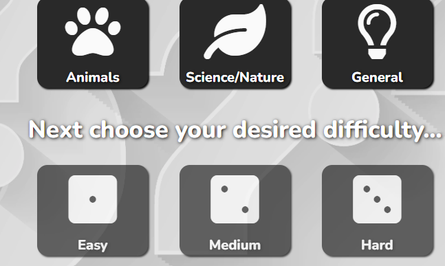

Once the category has been clicked as seen below, the difficulty may be clicked.

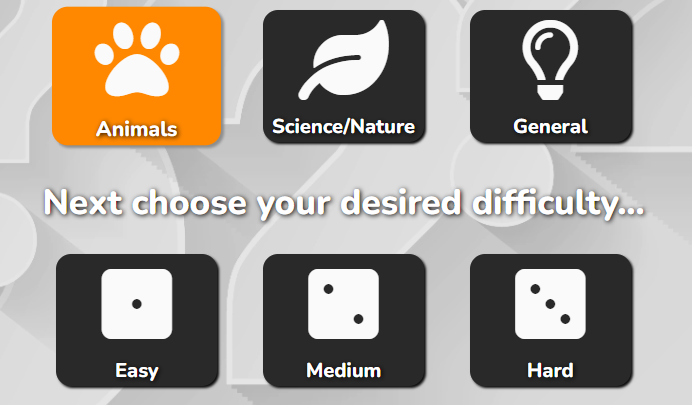

* Visual Feedback - this feature gives the user visual feedback whether their answer to the question was correct or not. In the event the user answers correctly the selected answer will flash gree for 1.5 seconds, if incorrect it will flash red for 1.5 seconds. I decided not to show the the user the correct answer at any time as I wanted to make the experience a bit more challenging if the wanted to attempt the quiz again.

Correct Answer: 

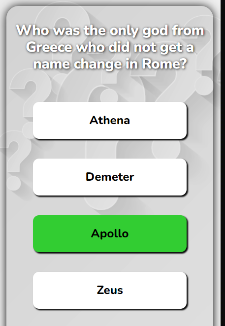

Wrong Answer: 

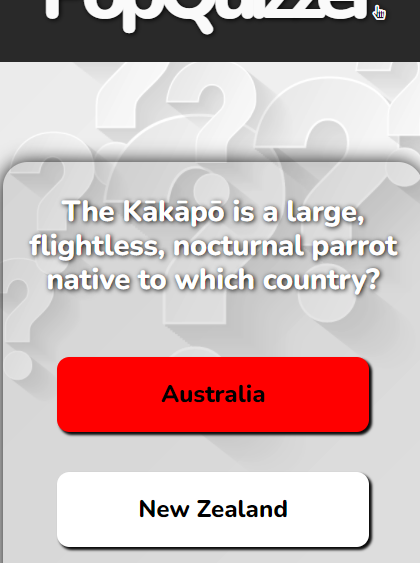

* Real-Time Score - this feature allow the user to keep track of their score in real-time as they navigate through the quiz. 

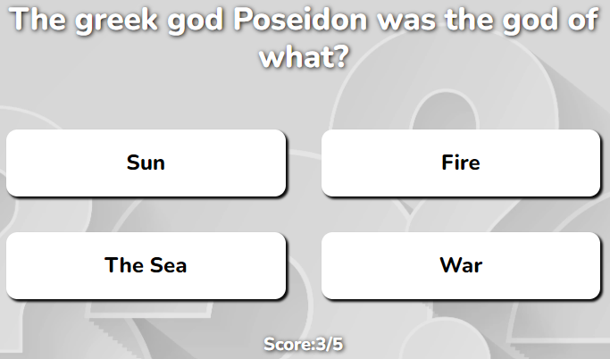

* Game Summary - this feature allows the user to see a summary of their quiz attempt. The summary tells the user what category and difficuly they selected. It also tells them how many questions out of a possible ten they got correct. There is a custom message that is generated depending on the score achieved. If the user scores equal to or less than 4/10 then the message reads: "Better luck next time!", if more than 4 but less than 9 then it reads: "Great effort!" & finally if the user scores 10/10 then the message reads: "You aced it!".

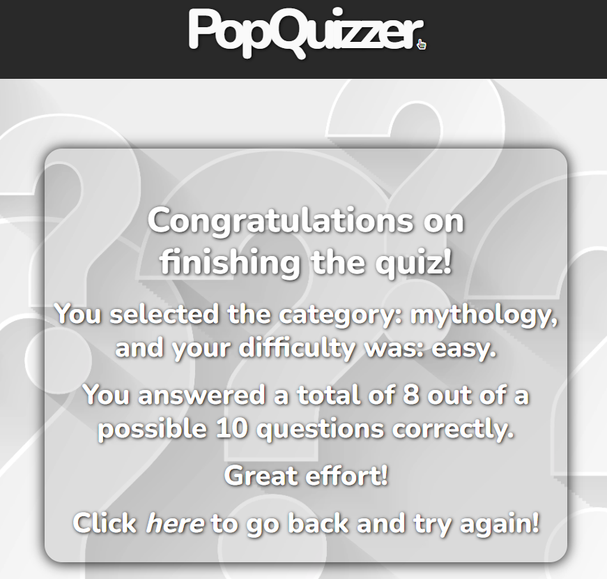

* Return to home option - this feature is a clickable link in the summary which allows the user to go back to he home screen to run the quiz again if they wish to do so. The user can also get to the home screen at anytime by clicking the logo in the navbar.

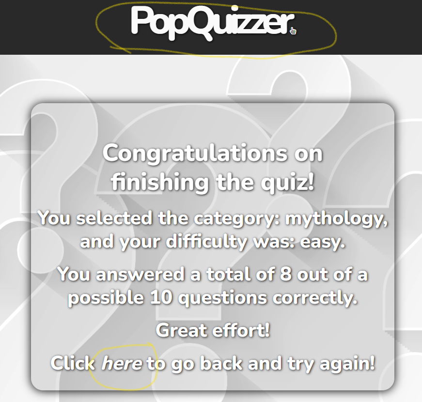

* The footer - this feature is at the bottom of the page and is an identical - albeit slightly smaller version of the navbar.

Some of the less obvious features include:

* Smooth scroll - this feature activates mainly when selecting a category. The smooth scroll feature will automatically scroll to the difficulty section thereby making it obvious that his is the next step, once a difficulty has been selected then the smooth scroll feature scrolls back up to the top section before starting the quiz. This also makes it a mre user firendly experience by eliminating unecessary scrolling.

* Quiz initialization message - this message pops up to alert the the quiz is about to begin. This feature will be more useful in the future when a time feature will be added and the user may want to be ready to try to beat a personal best score.

## Features to be implemented in the future

* As mentioned above, a timer will be added in a future version and the score will be increased by a certain amount depending on how quickly the user finished the quiz.
* A voice synthesizer will be added in a future version to allow the visually impaired to use the site more intuitively.
* An option to increase the amount of questions my multiples of ten will be added in a future version.
* Finally more categories from the API will be added in a dropdown box to be selected from in a future version.

# Technologies Used

## Languages

* [HTML5](https://en.wikipedia.org/wiki/HTML5)
* [CSS3](https://en.wikipedia.org/wiki/CSS#CSS_3)
* [JavaScript](https://en.wikipedia.org/wiki/JavaScript)

## Frameworks and Libraries

* [Bootstrap v5.0.0-beta2](https://getbootstrap.com/) was used responsiveness and layout purposes.
* [Google Fonts](https://fonts.google.com/) was used for the three fonts used in the site.
* [Font Awesome](https://fontawesome.com/) was used for the icons in the footer of the site.
* [Balsamiq](https://balsamiq.com/) was used to create the wireframes of the site.
* [Gitpod](https://www.gitpod.io/) was used to create the site.
* [GitHub](https://github.com/) was used to store the committed/pushed repositories of the site.
* [jQuery](https://en.wikipedia.org/wiki/JQuery) was used entirely to create the quiz.
* [Autoprefixer](https://autoprefixer.github.io/) was used to automatically add any required prefixes for the CSS stylesheet.
* [GitHub Wiki TOC generator](https://ecotrust-canada.github.io/markdown-toc/) was used to create the table of contents in the readme file.

# Testing

## User Stories Testing

1. As a user visiting the site for the first time, I want to be able to intuitively navigate the website.
  * The user can clearly see how to navigate the site when the page loads, when the user clicks on a category the site automatically scrolls to the difficulty selection sections and then scrolls back up to the top. Instructions and feedback are given to the user throughout the quiz.
1. As a user I want to be able to select the category that the quiz uses.
  * The user is able to select the category upon landing on the site. There are multiple choice categories for the user to choose from to tailor the quiz to their subject knowledge.
1. As a user I want to be able to select the difficulty that the quiz uses.
  * The user is prompted and is able to select their desired difficulty level once a category has been clicked. There are three different levels to choose from and the user can tailor the quiz further to their confidende level within their subject knowledge.
1. As a user I want to get feedback to tell me if my answer is correct or incorrect.
  * The user gets feedback throughout the quiz in the form of visual feedback. The selected answer flashed green and red for 1.5 seconds for right and wrong answers respectively, no feedback provided to tell the user the right answer if they got the question wrong, as I wanted the quix to be more challenging for repeat users. 
1. As a user I want to be able to see my score being updated in real-time.
* The user gets feedback throughout the quiz regarding their current score, and their current potential score. The potential score increments by 1 each time an answer is selected, regardless of being right or wrong. The correct score increments each time a correct answer is selected.
1. As a user I want to be given a summary of my quiz attempt when the game ends.
  * Once the game ends the user is given a summary of their quiz results. They are given a reminder of what category and difficulty combination they picked. They are also given a tally of their correct answers out of 10. Depending on how many answers they get correct the are given a custom message. The messages read: "Better luck next time!", if more than 4 but less than 9 then it reads: "Great effort!" & finally if the user scores 10/10 then the message reads: "You aced it!".
1. As a user I want to be able to navigate back to the home screen easily to take the quiz again.
  * The user is given the option to click on a link in the summary page to go back to the start and try again if they wish, there is also the option of going back to the homepage at any point by clicking the logo in the header/footer.

All of the user stories above were tested on small, medium, and large devices. All user stories were fully functional at the time of writing. 

## Additional testing

* The HTML code for both index.html & confirmation.html were tested using the [W3C HTML Validator](https://validator.w3.org/)

* The CSS code in the style.css file was tested using the [W3C CSS Validator](https://jigsaw.w3.org/css-validator/)

* The JavaScript code in the script.js file was tested using [JSHint](https://jshint.com/)

Testing was conducted on [Google Chrome](https://www.google.com/intl/en_ie/chrome/) throughout, and on [Firefox](https://www.mozilla.org/en-US/firefox/new/), [Safari](https://www.apple.com/safari/), [Microsoft Edge](https://www.microsoft.com/en-us/edge) and [iOS](https://www.apple.com/ie/ios/ios-14/) at the final testing stage.

Family members and friends with various devices assisted in testing the deployed site and reported no major bugs in deployed final site.

### Bugs during build

1. Issue with background image not loading on deployed site - issue not present on live server within GitPod. 
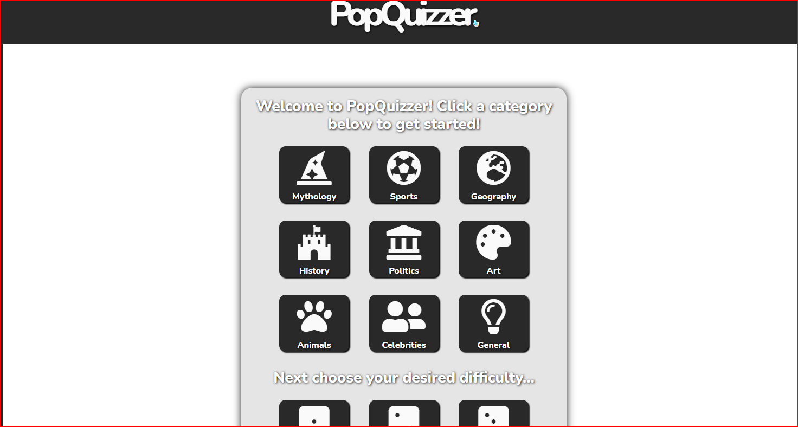
Changed path from absolute to relative and issue was resolved.
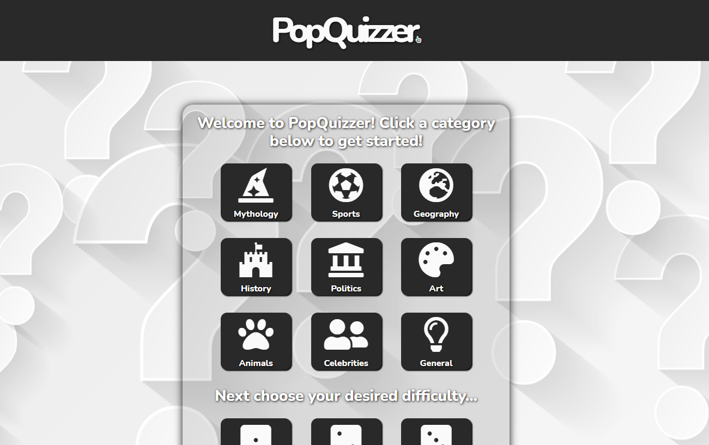
1. Data was not defined. It became clear that the issue was the scope of the data was not global.
[Data Not Defined](assets/bugs/data-not-defined.png)
I defined the data separately with global scope and this fixed the error.
[Data Defined](assets/bugs/data-defined.png)
1. Issue with the dynamically added "$('.ans1')" selectors not working. In the photo below I was attempting to generate an alert when the "ans1" was selected (.ans2, .ans3 & .ans4 were identically problematic solving for (.ans1) would solve for all).

This issue was particulary difficult to solve for someone relatively new to coding, as there were no console erroprs to indicate why the selectors didn't function. After some time I came across event delegation for dynamically added content and the code below solved the issue.
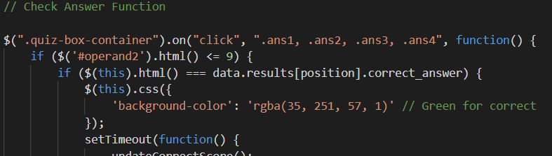
1. There was an issue with the link back to the homepage in the summary appearing blue even though I had tried to style it to be grey, I realized that my stylesheet appeared before the bootstrap link in the head. This meant that bootstrap would override and CSS rules which would explain why I had minor issues styling the site at the beginning. I realized that placing my own CSS stylesheet after the Bootstrap one would override it but upon tyring this the styling of the site changed dramatically in some parts. As I was close to the submission date I chose to leave it as it was and increase the specificity of the CSS class I tried earlier as a workaround which solved the problem. In future projects my own CSS style sheet will be placed after Bootstrap or any other Frameworks.
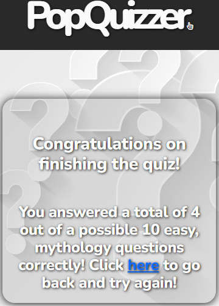

### Ongoing Bugs

1. There was a particularly confusing bug with the development on the quiz. I defined a variable "position" to have a value of "0" and placed the position variable in a number of areas signify the first posiion of an array. For some reason, the code did not work properly and questions were displaying with the wrong multiple choice answers when starting from position "0" initially, so I tried starting from a position of "-1" first and incrementing the position beore the quiz runs and this fixed this issue. It seems that the code works as intended from position zero only when incremented with a function first. I currently do not know why this works and the code works in its current state as the result of a lot of trial and error, and I am investigating this and will update this readme with any updates.

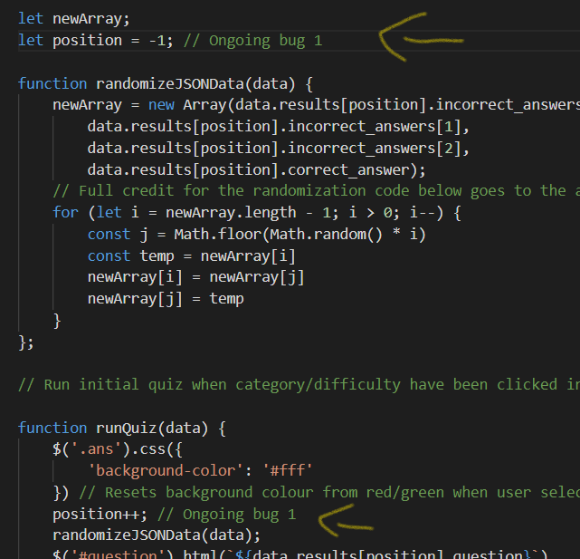

1. There is somme minor styling issues with the site which do not affect the usability of the site, but may affect the user experience slightly. The main issue is that some of the multiple choice answers from the API are quite long, some are whole sentences. This was not taken into consideration when styling the answer buttons and so very seldomly some of the answers can affect the formatting and plaement of the buttons as can be seen below. This issue was discovered late in the build due to the rarity of the event and there was not enough time to rectify the issue prior to submitting. The decision was made to submit the project regardless, as this is in my opinion a minor issue and the user may even think that this was intentional as the unintended formatting is generally symetrical and ordered.

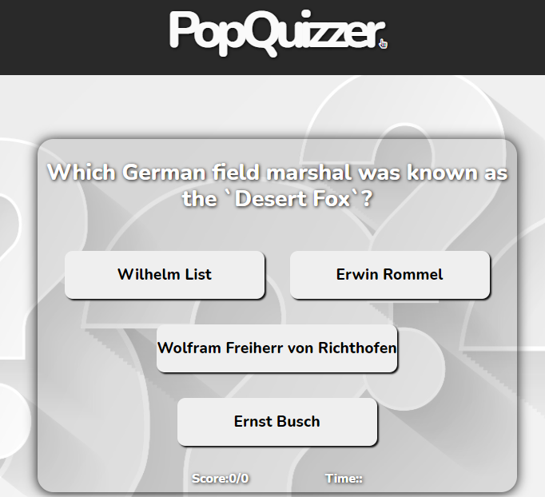

# Deployment

## GitHub Pages

The project was deployed to [GitHub Pages](https://pages.github.com/) using the following method:

1. [Login]() to [GitHub.]()
1. Locate your desired [repository.]()
1. Click [settings]() on the top of the repository.
1. Scroll down until you see [GitHub Pages.])
1. In the _source_ section, select the [master branch]) and click [save.]()
1. If successful the page will refresh, scroll down again to the GitHub Pages section to confirm. You should see a [confirmation message]() with the new published URL.

## Forking the published GitHub repository

1. Repeat steps 1 & 2 from above.
1. Locate the [fork]() option in the top-right hand corner of the repository page.
1. You will be asked where you want to fork it too if successful, see [here]() for example.

## Cloning the published GitHub repository

1. Repeat steps 1 & 2 from above.
1. Click on the [code]() option on the top of the repository page.
1. Copy the [URL]() under the HTTPS tab.
1. Consult your code editor of choice's documentation for cloning from GitHub to complete the process.

# Credits

## Images
[Freepik]() was utilized for the background image used on the site.
* Credit goes to the creator: [Starline](https://www.freepik.com/starline).

## Code
All code except for the mentions directly below were written entirely by the developer.

Full credit for the array randomization code (referred to in the script.js) goes to the authors - Ronald Fisher and Frank Yates. 

## Acknowledgements

Special thanks go to my mentor Chris Quinn and the whole Code Institute team who assisted me through this project.

Special thanks to the [Slack](https://slack.com/intl/en-ie/) community for assistance and guidance throughout the project.